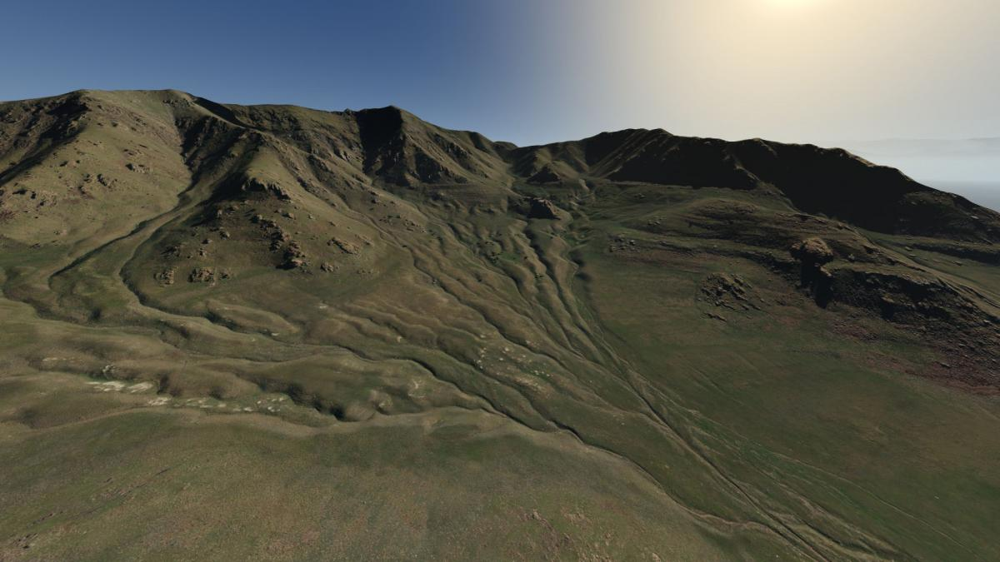
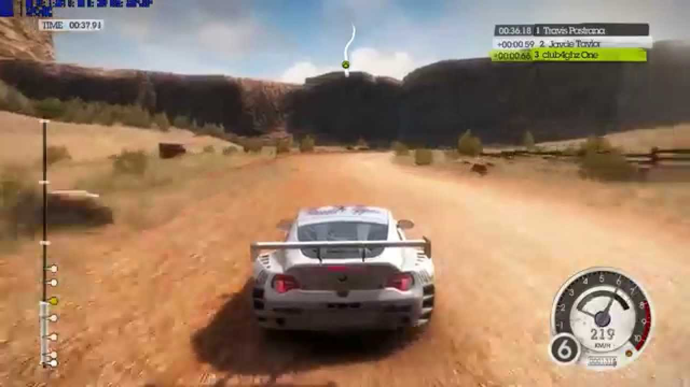
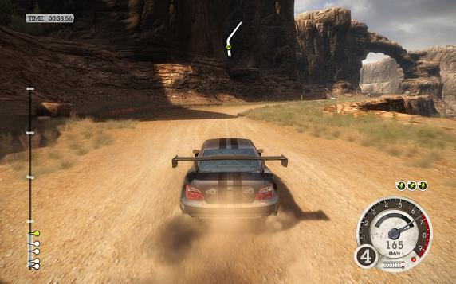

# Driver-Babylon.js
###### 3D Driving simulation built with Babylon.js

# Technologies Used
  - Babylon.js
  - Node.js
  - Express.js
  - Blender

# User Stories
  - As a user when I visit the homepage I should have the option of two driving modes, competitive and free ride.
  - As a user I should be able to see the car that I will be driving.
  - As a user I want to be able to use the directional buttons as my movement controls.
  - As a user I should be able to start and stop the car.
  - As a user if I crash into a wall, I should be able to go in reverse.
  - As a user I should be presented with a clear path as to where I am able to drive.
  - As a user I should know how fast I am going.
  - As a user I should not be able to drive through walls.
  - As a user I should be able to drive the car off the map.
  - As a user, if I drive off the map the game should end and an option for restart should appear.
  - As a user the gaming environment scenery should appear real.
  - A user should feel a smooth transition between accelerating and braking.
  - As a user if I chose competitive mode there should be a timer for the game.
  - As a user in competitive mode, I should have the goal to drive through checkpoints.
  - As a user when these checkpoints are hit, points should be added to a score.
  - As a user in competitive mode, when the timer runs out the round should end.
  - As a user in competitive mode, when the round ends, I should be able to play again or switch modes.
  - As a user in free-ride mode, I should not have a timer or checkpoints.

# Wireframes
 - Some inspirational pictures of what I hope it looks like.

